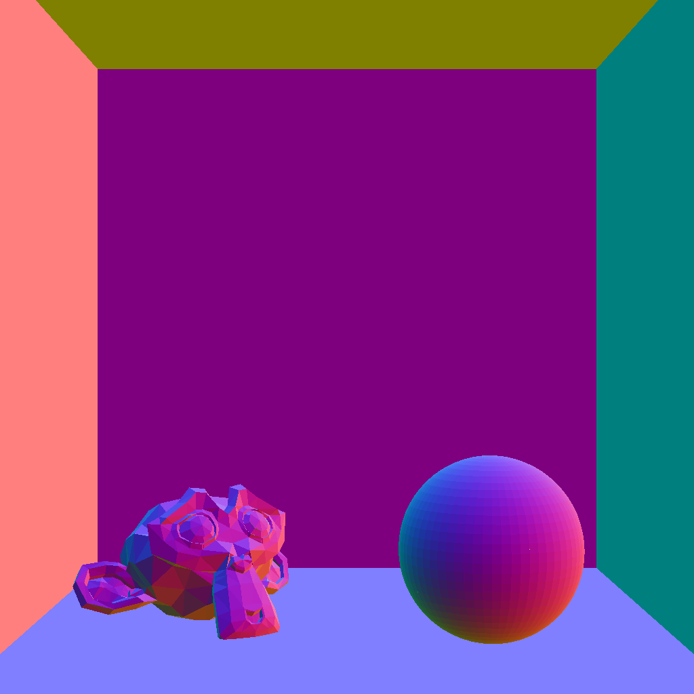

# Computer Graphics Assignments
This repository contains implementations for three assignments from the CS7.302: Computer Graphics course. Each assignment builds upon the previous one, progressively improving the rendering pipeline. The topics covered include ray-object intersections, acceleration structures, direct lighting, texture mapping, Monte Carlo integration, and importance sampling.

## Assignment 1: Ray-Object Intersection & Acceleration Structures
### Overview
This assignment focuses on making ray-object intersection tests more robust and efficient. Initially, a naive method was used, iterating over all objects and triangles. The goal was to optimize this process using a Bounding Volume Hierarchy (BVH).

### Key Implementations

- Camera Coordinate System Fix
- Identified and corrected rendering inconsistencies caused by large coordinate shifts.

### Acceleration Structures (BVH)

- Implemented Axis-Aligned Bounding Boxes (AABB) for each object.
- Constructed a BVH over bounding boxes to speed up intersection tests.
- Extended BVH to a two-level BVH, optimizing per-object intersection queries.

### Results

- Drastic improvement in rendering efficiency, reducing ray intersection time from O(n) to O(log(n)).
- Implemented a command-line option to switch between different intersection methods.
- Report: Q1-[Link](Assignment-1/q1Report.pdf), Q2- [Link](Assignment-1/q2Report.pdf)
- Following are some scenes generated using above code.     

<table>
  <tr>
    <td></td>
    <td></td>
  </tr>
</table>

## Assignment 2: Direct Lighting & Texture Mapping
Overview
This assignment introduces direct lighting with point and directional lights and implements texture mapping. The base renderer was modified to support multiple light sources and surface textures.

### Key Implementations
1. Direct Lighting
    - Loaded and stored light sources from scene files.
    - Implemented direct lighting for directional lights (sunlight).
    - Added point light support, calculating light contribution per pixel.

2. Texture Mapping
    - Implemented nearest-neighbor texture lookup.
    - Implemented bilinear interpolation for smoother textures.
    - Integrated texture fetches into the shading pipeline.

3. Custom Scene Creation
    - Desiged and rendered a scene with both textures and point lights.

### Results
- Rendered realistic scenes with improved lighting and texture fidelity.
- Compared different texture interpolation methods (nearest-neighbor vs. bilinear).
- Report : [Link](Assignment-2/report.pdf)
- Following are some scenes generated using above code.     

<table>
  <tr>
    <td></td>
    <td></td>
    <td></td>
  </tr>
</table>

<table>
  <tr>
    <td></td>
    <td></td>
    <td></td>
  </tr>
</table>

<table>
  <tr>
    <td></td>
  </tr>
</table>

## Assignment 3: Monte Carlo Integration & Importance Sampling
### Overview
This assignment extends lighting to area lights and implements Monte Carlo integration to solve the rendering equation numerically. Various importance sampling techniques were explored to improve rendering efficiency.

### Key Implementations
1. Pixel Subsampling for Anti-Aliasing
    -  Modified camera rays to sample across pixels, reducing aliasing artifacts.

2. Area Light Support
    - Implemented ray-area light intersection tests.
    - Modified the renderer to support diffuse shading from area lights.

3. Monte Carlo & Importance Sampling
    - Implemented uniform hemisphere sampling for light evaluation.
    - Implemented cosine-weighted sampling for better light distribution.
    - Implemented light sampling, focusing computation on actual light sources.

4. Performance Analysis
    - Rendered scenes with different sample counts (10, 100, 1000 spp).
    - Compared noise levels and render times for different sampling techniques.

### Results
- Achieved more accurate and realistic shading with area lights.
- Demonstrated the effectiveness of importance sampling over naive methods.
- Provided command-line options to control samples per pixel (spp) and sampling strategy.
- Report : [Link](Assignment-3/report.pdf)

